# DevTeamUp UML Diagrams

本项目包含了一组完整的UML图表，用于表示DevTeamUp系统的领域模型、限界上下文和各种状态转换。这些图表使用PlantUML开发，提供了系统架构的可视化表示。

## 目录

- [安装要求](#安装要求)
- [快速开始](#快速开始)
- [图表概览](#图表概览)
- [图表详情](#图表详情)
- [领域流程图](#领域流程图)
- [自定义图表](#自定义图表)
- [常见问题](#常见问题)

## 安装要求

要生成和查看这些UML图表，您需要：

1. **Java运行环境**：
   - 最低要求：Java 8
   - 检查是否已安装：`java -version`
   - 未安装时从[Java官方网站](https://www.java.com/download/)下载

2. **PlantUML**：
   - 已包含在项目中（`plantuml-mit-1.2025.2.jar`）
   - 无需额外安装

3. **GraphViz**（可选，在Windows上已内嵌）：
   - Linux用户可能需要额外安装

## 快速开始

### 生成所有图表

在项目根目录执行：

```bash
./generate-diagrams.sh
```

此脚本将生成所有UML图表并将输出保存到`./outputs`目录。

### 手动生成单个图表

如果您想手动生成特定图表：

```bash
java -jar plantuml-mit-1.2025.2.jar <puml文件路径>

# 例如生成用户上下文图表
java -jar plantuml-mit-1.2025.2.jar user-context-diagram.puml
```

### 使用Docker（可选）

也可以使用Docker运行PlantUML服务器：

```bash
docker pull plantuml/plantuml-server:jetty
docker run -d -p 8080:8080 plantuml/plantuml-server:jetty
```

然后在浏览器中访问：`http://localhost:8080/plantuml`

## 图表概览

项目包含以下UML图表：

1. **主上下文映射图** (`main-class-diagram.puml`)
   - 展示所有限界上下文及其关系
   - 包含反腐层(ACL)定义

2. **用户管理上下文** (`user-context-diagram.puml`)
   - 用户领域模型与实体关系
   - 用户生命周期与状态转换

3. **项目管理上下文** (`project-context-diagram.puml`)
   - 项目领域模型与实体关系
   - 项目生命周期与状态流转

4. **团队协作上下文** (`team-context-diagram.puml`)
   - 团队领域模型与实体关系
   - 团队形成与解散流程

5. **内容管理上下文** (`content-context-diagram.puml`)
   - 内容领域模型与实体关系
   - 内容创建与发布流程

6. **审核治理上下文** (`audit-context-diagram.puml`)
   - 审核领域模型与实体关系
   - 审核流程与策略管理

7. **状态图集合**
   - ~~各个上下文的状态转换图~~ 现已拆分为单独的状态图：
   - 用户账号状态图 (`user-state.puml`)
   - 项目管理状态图 (`project-state.puml`)
   - 团队生命周期状态图 (`team-state.puml`)
   - 内容/文章状态图 (`content-state.puml`)
   - 审核流程状态图 (`audit-state.puml`)

8. **领域流程图**
   - 用户管理流程图 (`user-workflow.puml`)
   - 项目管理流程图 (`project-workflow.puml`)
   - 团队协作流程图 (`team-workflow.puml`)
   - 内容管理流程图 (`content-workflow.puml`)
   - 审核治理流程图 (`audit-workflow.puml`)

## 图表详情

### 主上下文映射图

主图展示了系统中的5个限界上下文及其相互作用：

- 人员管理上下文(User Management)
- 项目管理上下文(Project Management)
- 团队协作上下文(Team Collaboration)
- 内容管理上下文(Content Management)
- 审核治理上下文(Audit Governance)

图中通过5个反腐层(ACL)连接各个上下文，确保上下文间的松耦合：

- UserAuditACL：用户资质审核流程
- ProjectAuditACL：项目审核流程
- TeamProjectACL：团队与项目关联
- TeamUserACL：团队成员管理
- ContentUserACL：内容作者关联

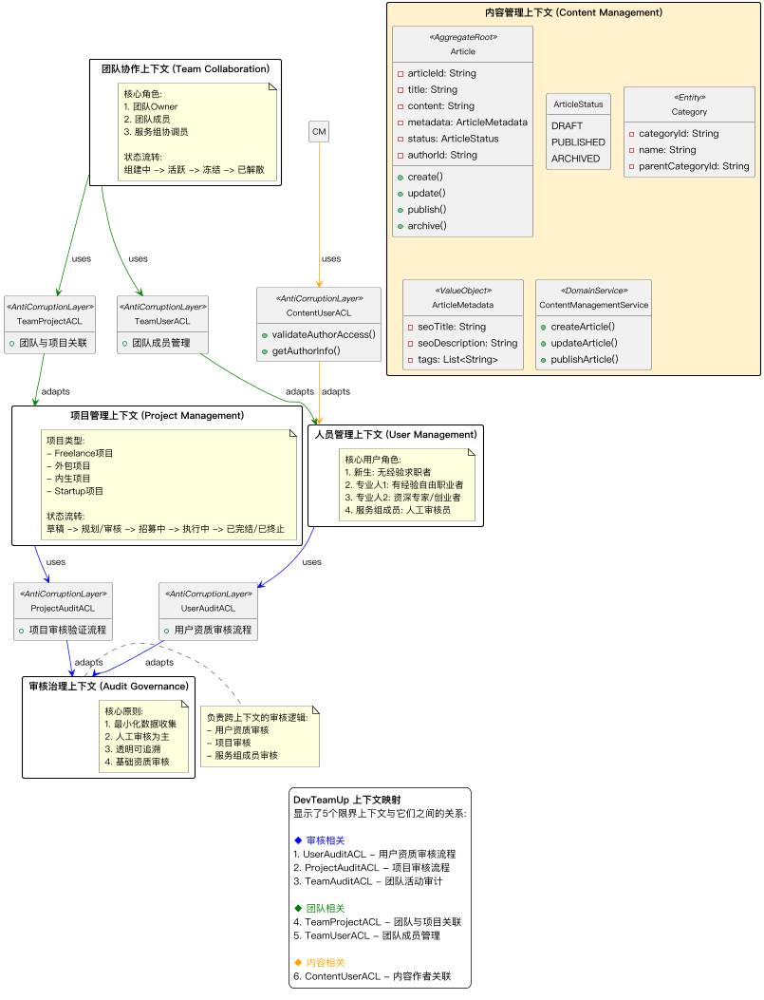

### 用户管理上下文

用户上下文图表示用户的领域模型，包含：

- 用户聚合根与相关实体
- 用户资料、技能和凭证
- 用户状态流转：未验证 → 待审核 → 活跃 → 锁定/受限/失活 → 封禁/注销
- 用户旅程阶段：身份注册、个人画像、账户管理

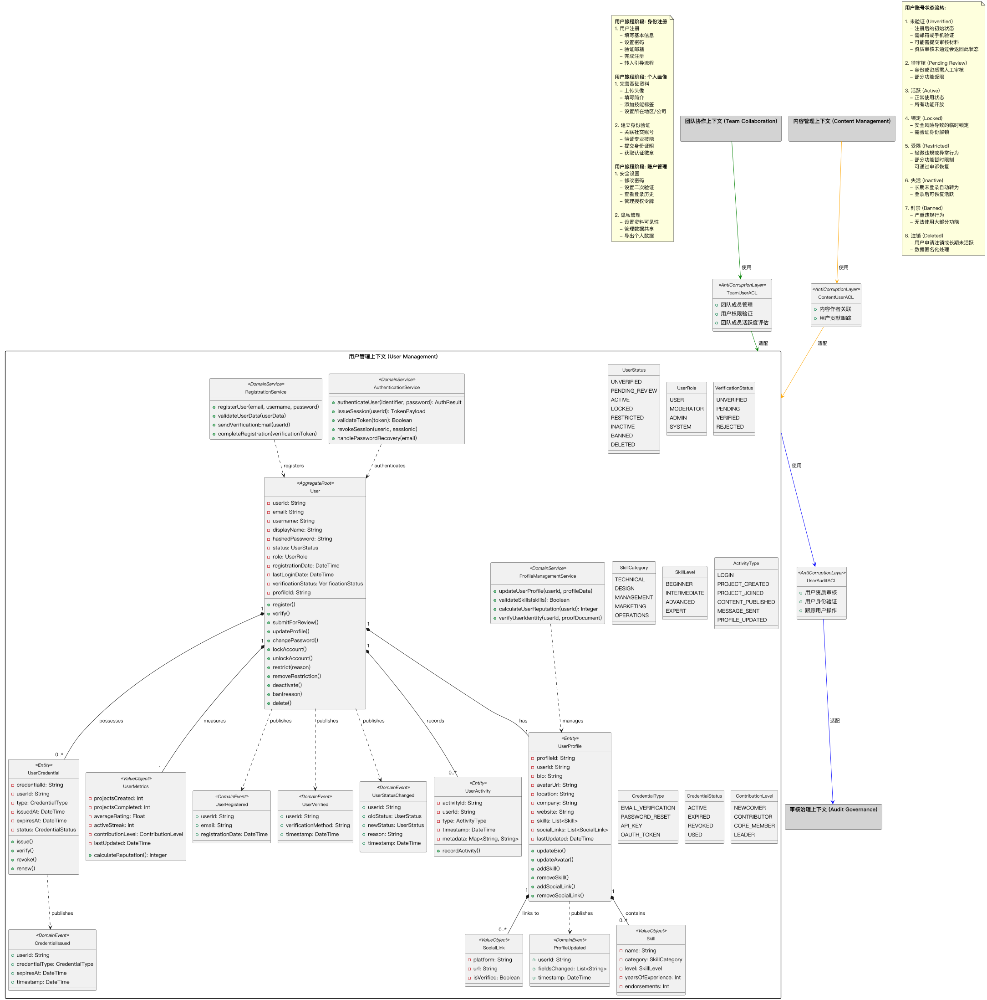

### 项目管理上下文

项目上下文图表示项目的领域模型，包含：

- 项目聚合根与相关实体
- 里程碑、任务和资源
- 项目状态流转：草稿 → 规划/审核 → 招募中 → 执行中 → 已完结/已终止
- 项目可见性规则：**只有处于"执行中"状态的项目才会公开可见**，其他状态的项目仅对项目成员和管理员可见
- 用户旅程阶段：项目创建与计划、项目执行与监控、项目收尾

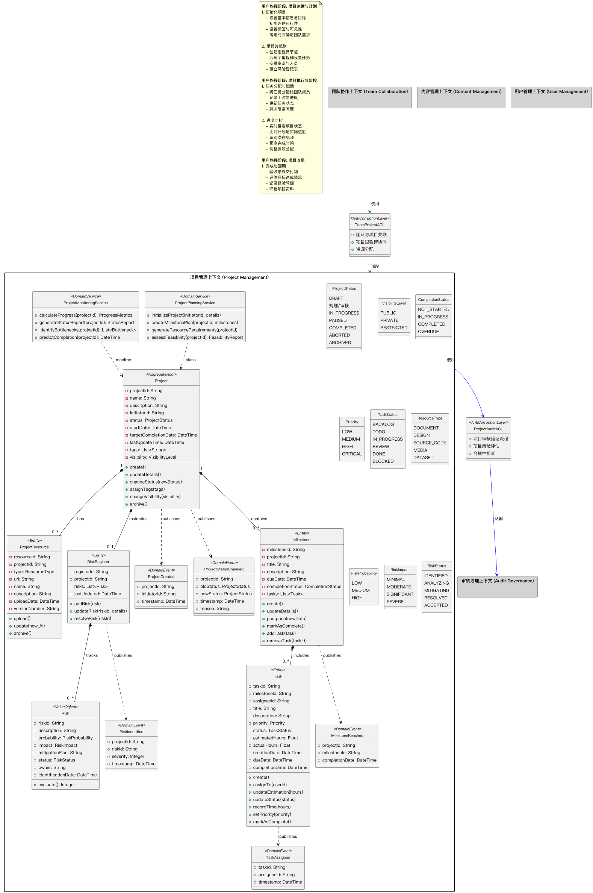

### 团队协作上下文

团队上下文图表示团队的领域模型，包含：

- 团队聚合根与成员实体
- 团队申请与邀请机制
- 团队状态流转：组建中 → 活跃 → 冻结 → 已解散
- 用户旅程阶段：团队动态组建、成员加入、成员退出

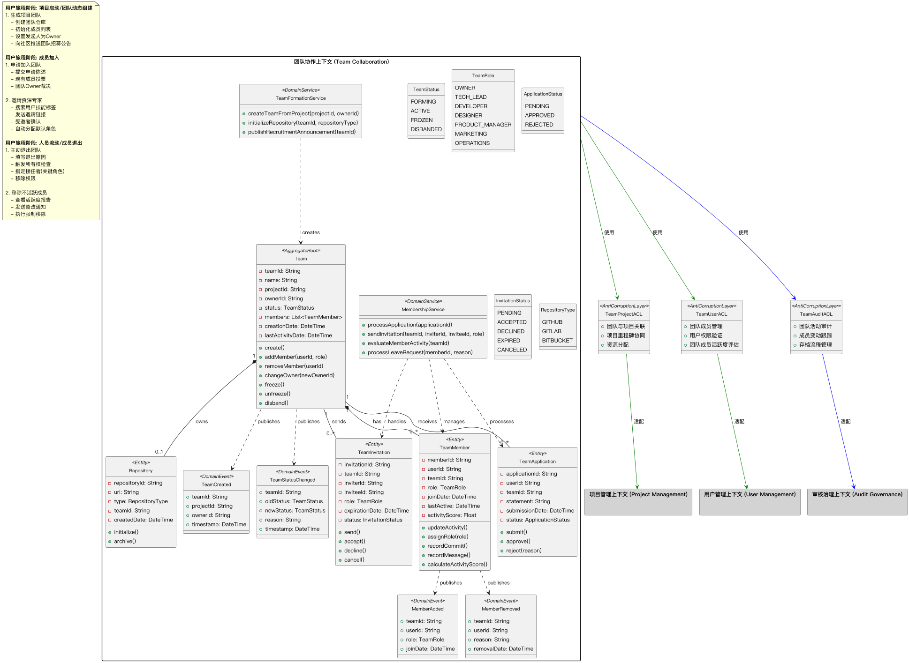

### 内容管理上下文

内容上下文图表示内容的领域模型，包含：

- 文章聚合根与相关实体
- 内容分类与元数据
- 内容状态流转：草稿 → 已发布 → 已归档
- 内容管理流程：创建与发布、分类、基础SEO

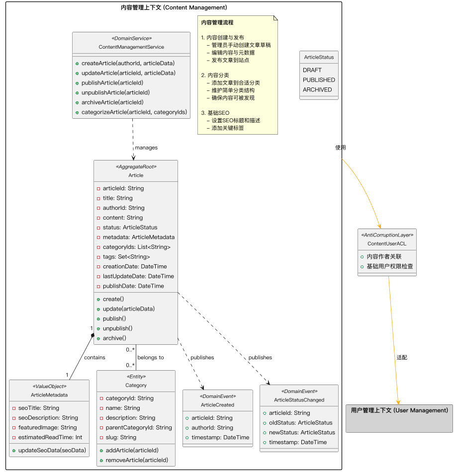

### 审核治理上下文

审核上下文图表示审核的领域模型，包含：

- 审核记录与审核策略
- 审核工作流与问卷
- 审核流程：创建 → 进行中 → 需要信息 → 已完成
- 核心原则：最小化数据收集、人工审核为主、透明可追溯、基础资质审核

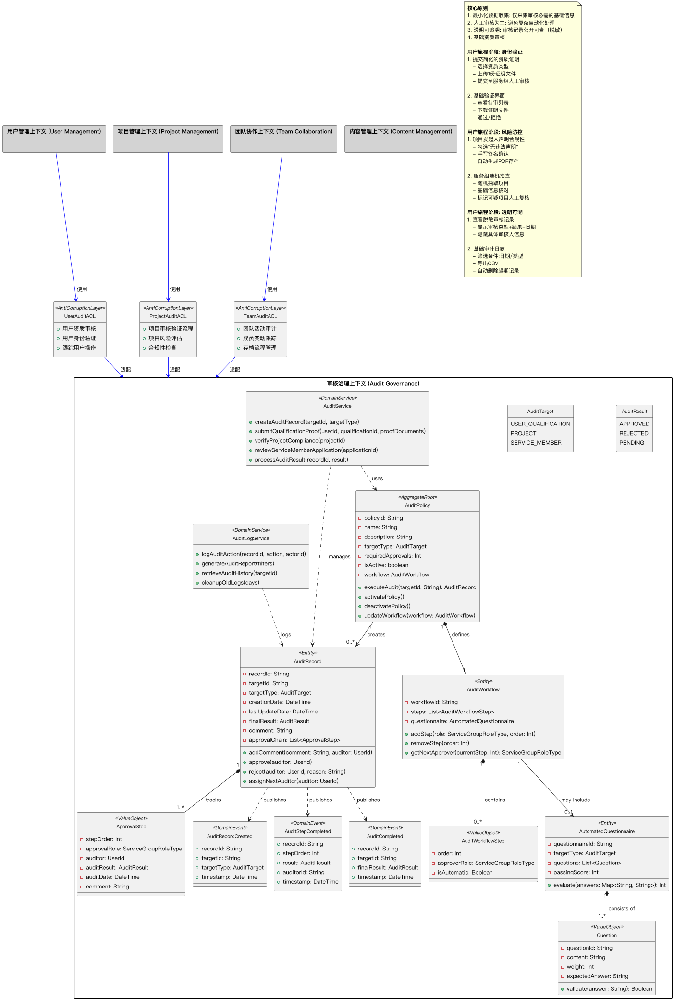

### 状态图集合

状态图已拆分为独立的五个图表，每个图表专注于一个领域的状态转换：

- **用户账号状态流转图**：展示用户从未验证到活跃再到可能的受限、锁定或注销的完整状态流转
  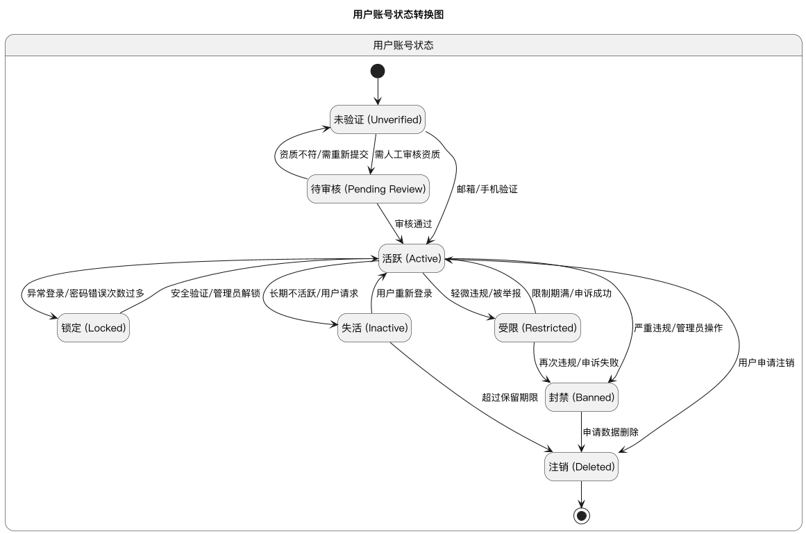

- **项目管理状态流转图**：展示项目从草案到执行再到完成或终止的状态流转
  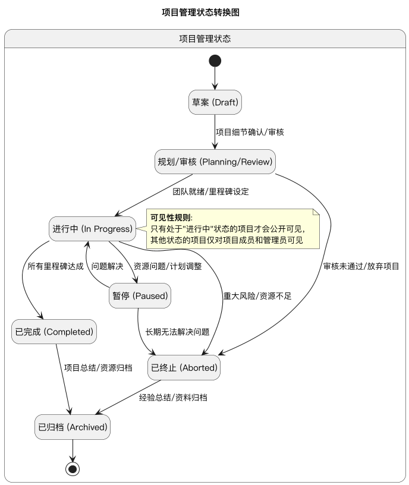

- **团队生命周期状态图**：展示团队从组建中到活跃再到可能的冻结或解散的状态流转
  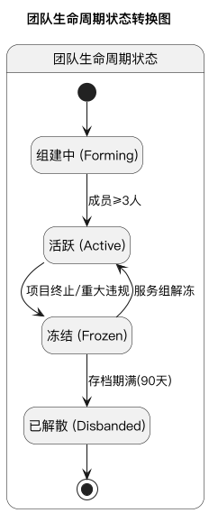

- **文章内容状态流转图**：展示内容从草稿到发布再到归档的状态流转
  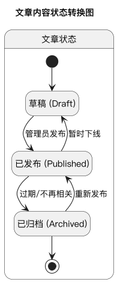

- **审核流程状态流转图**：展示审核过程的各个状态和转换
  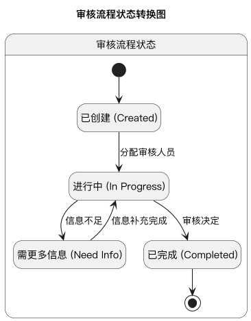

## 领域流程图

为了更清晰地展示各个领域的业务流程，我们提供了一系列流程图，每个图专注于一个特定领域的主要工作流程。

### 用户管理流程图

用户管理流程图展示了用户从注册到使用系统的完整生命周期，包括：

- 用户注册与身份验证
- 个人资料完善
- 账号状态管理（正常使用、受限、封禁等）
- 账号注销流程

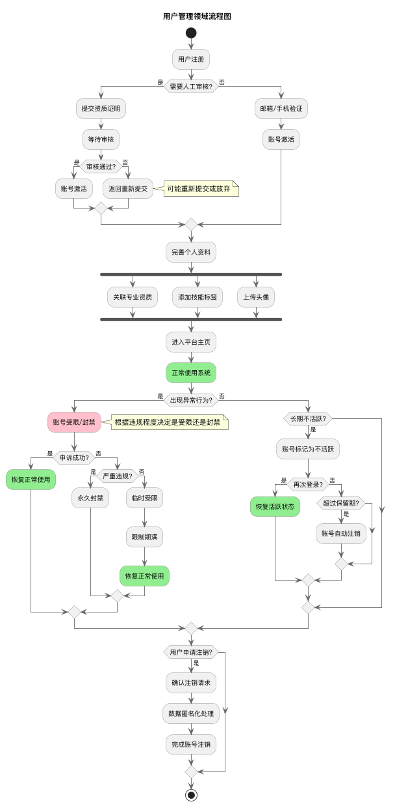

### 项目管理流程图

项目管理流程图展示了项目从创建到归档的完整生命周期，包括：

- 项目创建与审核
- 团队组建与项目启动
- 项目执行与监控
- 项目暂停、完成与归档
- 明确标注了项目在不同阶段的可见性规则

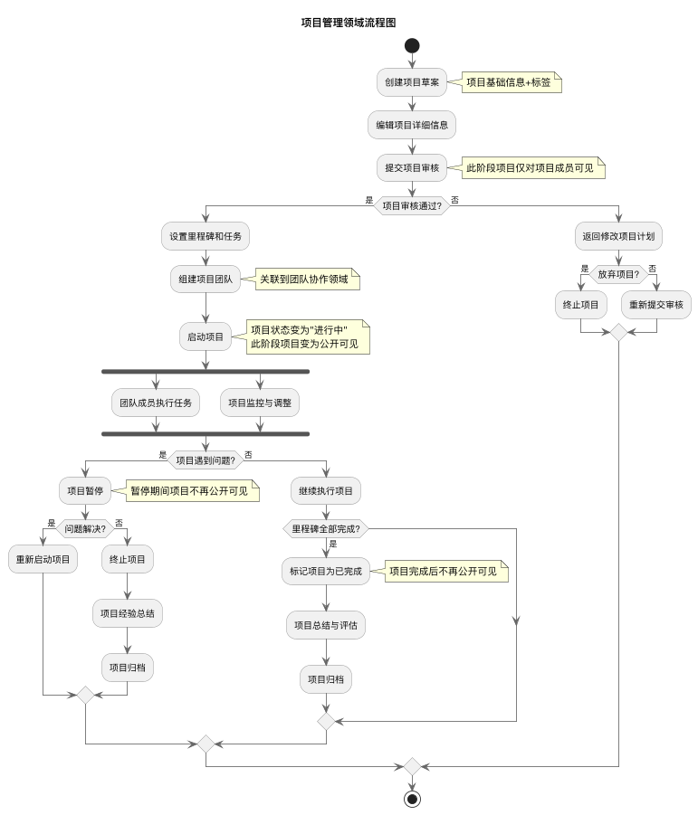

### 团队协作流程图

团队协作流程图展示了团队的组建和协作过程，包括：

- 团队创建与角色设置
- 成员招募（公告与邀请）
- 团队协作活动
- 团队解散或转入新项目

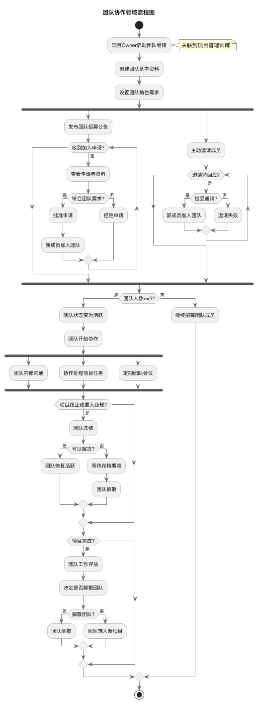

### 内容管理流程图

内容管理流程图展示了内容的创建、发布和管理流程，包括：

- 内容创建与编辑
- 元数据设置与分类
- 内容审查与发布
- 内容更新与归档

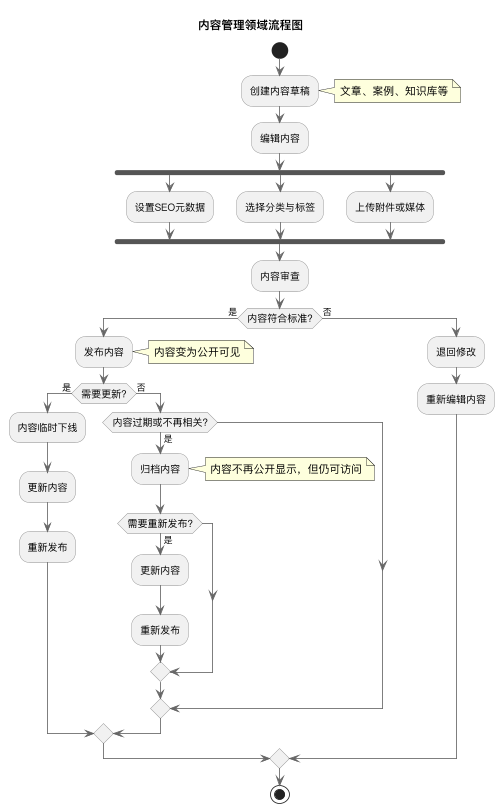

### 审核治理流程图

审核治理流程图展示了系统中各类审核的处理流程，包括：

- 不同类型审核的接收处理
- 自动初步筛查与人工审核
- 补充信息请求流程
- 审核决定与结果通知

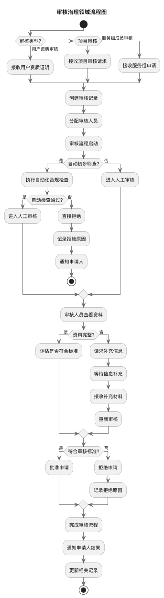

## 自定义图表

您可以通过编辑`.puml`文件来自定义这些图表：

1. 修改`skinparam`设置以更改外观
2. 调整布局参数以优化空间使用
3. 添加或修改实体、关系和注释
4. 调整DPI参数以控制输出图像的大小

常用的全局配置参数：

```
scale 0.8                       # 缩放比例
!pragma layout smetana          # 布局算法
skinparam dpi 100               # 输出DPI
skinparam backgroundColor white # 背景色
```

## 常见问题

### 图表生成失败

如果图表生成失败，请检查：

1. Java是否正确安装
2. 在复杂图表中是否有语法错误
3. 检查错误消息中提到的行号

### 图表太大

如果生成的图表太大，可以：

1. 减小DPI值（例如从100改为75）
2. 增加缩放比例（例如从0.8改为0.6）
3. 拆分复杂图表为多个小图表

### 定制样式

要修改图表样式，编辑`.puml`文件顶部的全局配置部分，调整字体、颜色和布局参数。

---

## 参考资源

- [PlantUML官方文档](https://plantuml.com/zh/starting)
- [PlantUML语言参考指南](https://plantuml.com/zh/)
- [领域驱动设计(DDD)参考](https://www.domainlanguage.com/)

---

如有问题或建议，请提交Issue或贡献代码改进。
